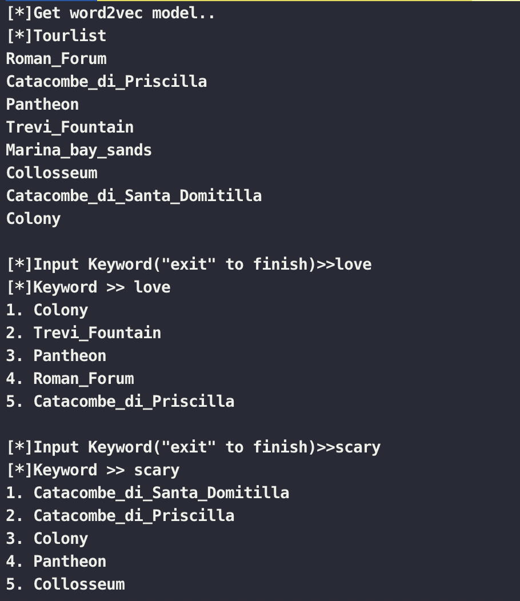

## Tourist_Clustering

### HOW

**Scrapy reviews of tourisr** from Trip Advisor

- Use selenium

- need chromedriver

- need to set tourlist_url.json file(default 5 tourlist)

Save it to csv file

**Get Word2vec model**

Calculate **uclidean Distance** and get result

### RUN

 Check your chrome version and download driver from [here][https://chromedriver.chromium.org/downloads] at **./utils/**chromedriver

 Download [GoogleNews-vectors-negative300.bin][https://drive.google.com/file/d/0B7XkCwpI5KDYNlNUTTlSS21pQmM/edit] at **./utils/**

$cd src

$python3 get_reviews.py # reviews csv file make
$python3 demo.py # run

**Result**

